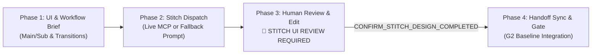

# Purpose

Google Stitch 디자인 도구와 Antigravity Agent를 연동하여,
승인된 요구사항 기반의 UI 디자인 프롬프트를 생성/전달하고,
디자인 컨텍스트(토큰, 레이아웃, 컴포넌트)를 안전하게 가져와 `UI_DESIGN_HANDOFF.md`, `STITCH_PROMPTS.md`, `STITCH_PROJECT_REF.json`으로 구조화한다.

# Applicable Stages

DESIGN, BUILD, VERIFY

# Primary Agent

@ux

# Supporting Agents

- @architect
- @engineer
- @qa

# Inputs

- Approved Requirements & Acceptance Criteria
- `docs/02-design/ui/UI_DESIGN_BRIEF.md`
- Stitch MCP Configuration in `.agents/mcp_config.json` (or global MCP config)
- Stitch Project ID / Name / API Key

# Operation Lifecycle & Modes

Stitch 연동은 다음 **4단계 수명주기(4-Phase Lifecycle)** 를 따릅니다:



### 1. Phase 1: UI 사양 및 화면 워크플로우 정의 (Specification)
- `docs/02-design/ui/UI_DESIGN_BRIEF.md` 생성:
  - **Main Screens**: 대시보드, 메인 워크스페이스 등 주요 진입 화면.
  - **Sub Screens & Modals**: 상세 뷰, 생성/수정 모달, 검색/필터 패널 등 보조 화면.
  - **Screen Workflow & Transition Map**: 화면 간 전이 트리거, 파라미터 전달, 닫기/뒤로가기 복귀 흐름, Mermaid 플로우차트.
  - **Multilingual UI Support**: 한국어(`ko`)/영어(`en`) 전환 지원, 언어 전환기 컴포넌트, 한-영 텍스트 길이 가변성(1.3~1.5x)을 수용하는 반응형 레이아웃 명세.

### 2. Phase 2: Stitch 디자인 생성 요청 전달 (Generation Dispatch)
* **Mode 1 (Live MCP Mode)**:
  - `.agents/mcp_config.json`에 Stitch MCP 서버 연결 확인.
  - Main/Sub 화면 사양, 화면 간 워크플로우 및 다국어(ko/en) 호환 레이아웃 파라미터를 MCP 파라미터로 일괄 전달하여 디자인 프로젝트 및 화면 생성 호출.
* **Mode 2 (Fallback Prompt Mode)**:
  - Stitch MCP 미연결 시 `STITCH MCP SETUP REQUIRED` 알림 출력.
  - `docs/02-design/ui/STITCH_PROMPTS.md`에 Global Context(다국어 CJK/Latin 폰트 지시문 포함), Main Screen Prompts, Sub Screen Prompts, Inter-screen Workflow Prompts를 자동 생성하여 사용자 제공.

### 3. Phase 3: 인간 디자이너/개발자 검토 및 수정 대기 (Blocking Human Review Gate)
- **CRITICAL**: Stitch에서 초기 화면이 자동 작성 완료된 후, 에이전트는 **절대 다음 단계를 임의로 진행하지 않고 즉시 실행을 중단**한다.
- 에이전트는 다음 메시지를 출력하고 대기한다:
  ```text
  STITCH UI DESIGN REVIEW & REFINEMENT REQUIRED
  Project: <PROJECT_NAME_OR_ID>

  Stitch has completed initial automated design generation for Main/Sub screens and workflows.
  Human review and adjustments are required in Google Stitch.

  Actions for Human:
  1. Open Google Stitch (Project: <PROJECT_ID_OR_NAME>).
  2. Review and refine the UI design, layouts, typography/colors, and screen workflows.
  3. When all edits and reviews in Stitch are complete, execute:
     CONFIRM_STITCH_DESIGN_COMPLETED
  ```

### 4. Phase 4: 완료 확인 및 Handoff 동기화 (Confirmation & Baseline Handoff)
- 인간으로부터 `CONFIRM_STITCH_DESIGN_COMPLETED` 명령을 수령한 후:
  1. Stitch의 최종 결과물(토큰, 레이아웃, 컴포넌트 메타데이터)을 `docs/02-design/ui/UI_DESIGN_HANDOFF.md`에 최종 동기화.
  2. `docs/02-design/ui/STITCH_PROJECT_REF.json`에 `human_review_status: "COMPLETED"`, `confirmed_by`, `confirmed_at` 기록.
  3. Main/Sub 화면 및 Screen Workflow의 요구사항 충족 여부를 검증하고 `G2 DESIGN BASELINE APPROVAL REQUIRED` 심사 패키지를 준비.

# Stitch MCP Configuration Guide

### 방법 1: 프로젝트 로컬 `.agents/mcp_config.json`에 등록 (권장)
* **Remote SSE / HTTP 방식**:
```json
{
  "mcpServers": {
    "github": {
      "command": "npx",
      "args": ["-y", "@modelcontextprotocol/server-github"],
      "env": {
        "GITHUB_PERSONAL_ACCESS_TOKEN": "<YOUR_GITHUB_PAT>"
      }
    },
    "stitch": {
      "serverUrl": "https://stitch.googleapis.com/mcp",
      "headers": {
        "X-Goog-Api-Key": "<YOUR_GOOGLE_STITCH_API_KEY>"
      }
    }
  }
}
```
* **Stdio / Local npx 방식**:
```json
{
  "mcpServers": {
    "stitch": {
      "command": "npx",
      "args": ["-y", "@google/stitch-mcp-server"],
      "env": {
        "STITCH_API_KEY": "<YOUR_GOOGLE_STITCH_API_KEY>",
        "STITCH_PROJECT_ID": "<PROJECT_ID>"
      }
    }
  }
}
```

### 방법 2: Antigravity IDE 전역 MCP 설정에 등록
`~/.gemini/antigravity/mcp/` 또는 `~/.gemini/config/mcp_config.json`에 Stitch 서버 스키마 및 환경설정을 구성하여 모든 워크스페이스에서 공통 사용.

# Critical Rules

- **Fail-Closed Principle**: 사용자가 `USE_STITCH`를 선택했으나 MCP 미연결 시 임의로 UI를 생략하거나 코딩으로 직행하지 않으며, Fallback Prompt 모드로 전환하여 반드시 UI Handoff 산출물을 완결해야 G2 승인이 가능하다.
- **Secret Protection**: Stitch API Key나 토큰은 절대 문서나 코드베이스에 직접 커밋하지 않는다.
- **SSOT Hierarchy**: `Approved Requirement -> Approved UI Design Handoff -> Approved Stitch Project Reference -> Implementation`.
- **Conflict Escalation**: `DESIGN.md`와 Stitch UI 디자인 간 불일치 시 `DESIGN CONFLICT DETECTED`를 보고한다.

# Output

- `docs/02-design/ui/UI_DESIGN_BRIEF.md`
- `docs/02-design/ui/STITCH_PROMPTS.md` (Stitch 선택 시)
- `docs/02-design/ui/UI_DESIGN_HANDOFF.md`
- `docs/02-design/ui/STITCH_PROJECT_REF.json`
- `docs/04-test/UI_VERIFICATION_REPORT.md` (검증 단계)
