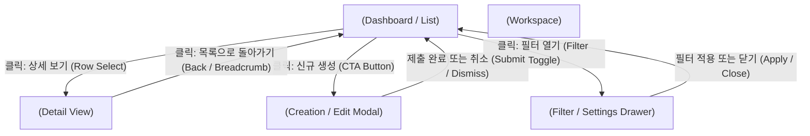

# UI Design Brief: <PROJECT_OR_FEATURE_NAME>

## Target Users
- <PRIMARY_PERSONAS_AND_TARGET_USERS>

## Primary User Goals
- <KEY_GOALS_USERS_WANT_TO_ACCOMPLISH>

## Required Screens

### 1. Main Screens (1차 진입/핵심 화면)

| Screen Name | Route / Path | Primary Purpose | Key Controls & Display Entities | Related Requirement |
|---|---|---|---|---|
| `<MAIN_SCREEN_1>` | `<ROUTE_1>` | `<PRIMARY_PURPOSE>` | `<KEY_CONTROLS_AND_DATA>` | `<REQ_ID_OR_FR_ID>` |
| `<MAIN_SCREEN_2>` | `<ROUTE_2>` | `<PRIMARY_PURPOSE>` | `<KEY_CONTROLS_AND_DATA>` | `<REQ_ID_OR_FR_ID>` |

### 2. Sub Screens, Modals & Drawers (2차 보조 화면 / 다이얼로그)

| Sub Screen / Modal | Parent Screen | Trigger Condition | Purpose & Input/Output | Related Requirement |
|---|---|---|---|---|
| `<SUB_SCREEN_1>` | `<PARENT_MAIN_SCREEN>` | `<BUTTON_CLICK_OR_ROW_SELECT>` | `<DETAIL_VIEW_OR_FORM>` | `<REQ_ID_OR_FR_ID>` |
| `<MODAL_OR_DRAWER_1>` | `<PARENT_MAIN_SCREEN>` | `<CLICK_ACTION>` | `<DRAWER_FILTER_OR_CONFIRM>` | `<REQ_ID_OR_FR_ID>` |

## Screen Workflow & Transition Map

### 1. Screen Flow Diagram (Mermaid)



### 2. Inter-Screen Transition Matrix

| Source Screen | Trigger Event / User Action | Target Screen / Modal | Parameter & State Binding | Return / Dismiss Flow |
|---|---|---|---|---|
| `<MAIN_SCREEN_1>` | `<ROW_CLICK_EVENT>` | `<SUB_SCREEN_1>` | `selected_id: <ENTITY_ID>` | `Back button -> Return to Main` |
| `<MAIN_SCREEN_1>` | `<OPEN_MODAL_EVENT>` | `<MODAL_1>` | `mode: "CREATE" / "EDIT"` | `Submit -> Toast & Refresh Main` |
| `<MAIN_SCREEN_1>` | `<OPEN_DRAWER_EVENT>` | `<DRAWER_1>` | `filter_state: <CRITERIA>` | `Apply -> Update Main Table` |

## Required States
- **Default**: <DEFAULT_VIEW_STATE>
- **Loading**: <SKELETON_OR_SPINNER_STATE>
- **Empty**: <ZERO_DATA_GUIDE_STATE>
- **Error**: <INLINE_OR_BANNER_ERROR_STATE>
- **Success**: <COMPLETION_OR_TOAST_FEEDBACK_STATE>

## Responsive Requirements
- Desktop: <DESKTOP_LAYOUT_GUIDELINES>
- Mobile/Tablet: <MOBILE_VIEWPORT_GUIDELINES>

## Accessibility Requirements
- Color Contrast (WCAG AA): <CONTRAST_RATIO_TARGETS>
- Keyboard Navigation & Focus Order: <FOCUS_FLOW>
- Screen Reader Labels: <ARIA_LABELING_REQUIREMENTS>

## Multilingual (i18n) UI Specifications
- **Supported Locales**: Korean (`ko`, Default), English (`en`, Fallback)
- **Language Switcher Component**: `<HEADER_OR_NAVBAR_LANGUAGE_DROPDOWN_OR_TOGGLE>`
- **Typography & Readability**:
  - Korean (Hangul CJK): Font stack supporting Hangul with `word-break: keep-all;`
  - English (Latin): Standard modern sans-serif
- **Layout Expansion Tolerance**: All buttons, cards, table headers, and badges must accommodate a minimum 1.3x~1.5x text length expansion between English and Korean without clipping.

## Out of Scope
- <EXPLICIT_UI_OUT_OF_SCOPE_ITEMS>

## Stitch Design Generation Dispatch
```text
<STRUCTURED_PROMPT_PREPARED_FOR_GOOGLE_STITCH_INCLUDING_MAIN_SUB_SCREENS_AND_WORKFLOWS>
```
