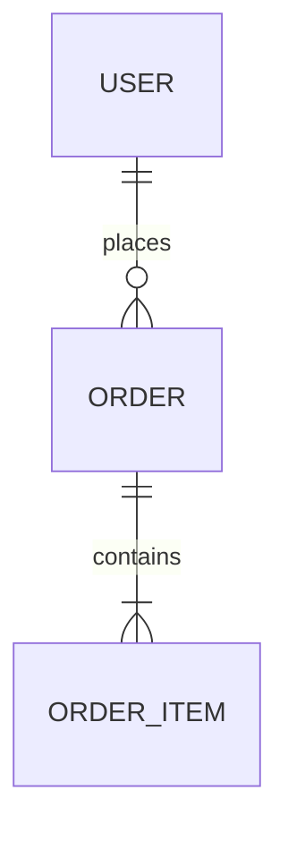

# Data Model & Schema

## Entity Relationship

```mermaid
erDiagram
    USER ||--o{ ORDER : places
    ORDER ||--|{ ORDER_ITEM : contains
```

## Schema Definitions
Detailed field names, data types, constraints, and index strategies.
